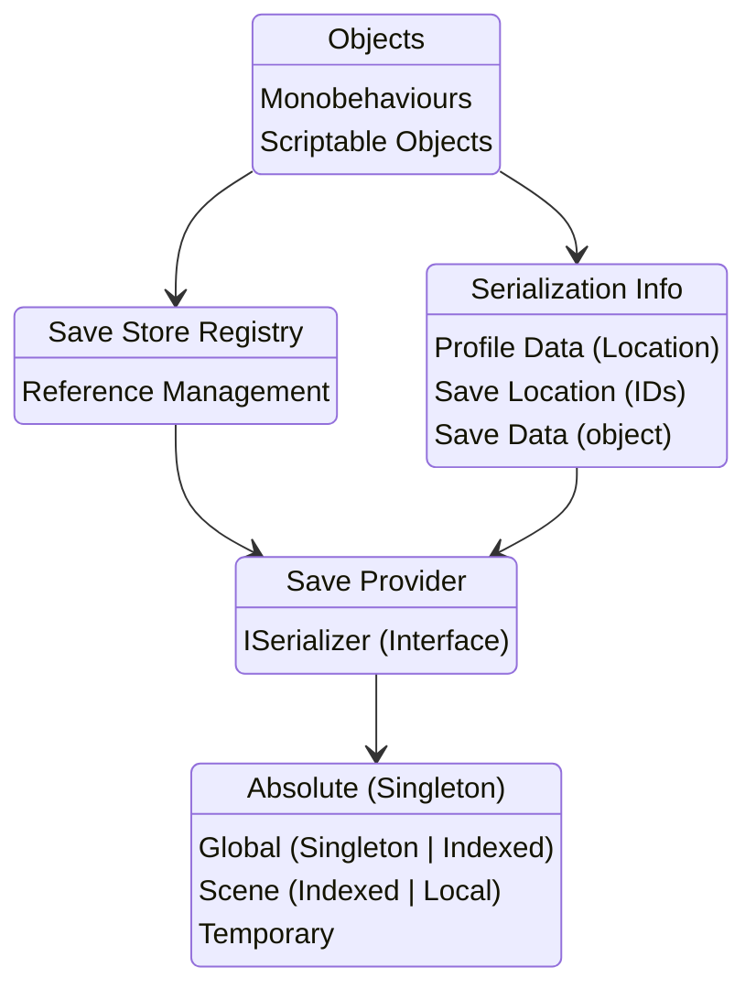

# Sanctuary
A Dynamic Save System For Unity

# System Flow Chart

```mermaid
stateDiagram-v2
    s0: Save Store Registry
    s0: Reference Management

    s1 : Save Provider
    s1 : ISerializer (Interface)

    s2 : Absolute (Singleton)
    s2 : Global (Singleton | Indexed)
    s2 : Scene (Indexed | Local)
    s2 : Temporary

    o0 : Objects
    o0 : Monobehaviours
    o0 : Scriptable Objects

    o1 : Serialization Info
    o1 : Profile Data (Location)
    o1 : Save Location (IDs)
    o1 : Save Data (object)  

    o0 --> o1
    o0 --> s0
    s0 --> s1
    o1 --> s1     
    s1 --> s2
```