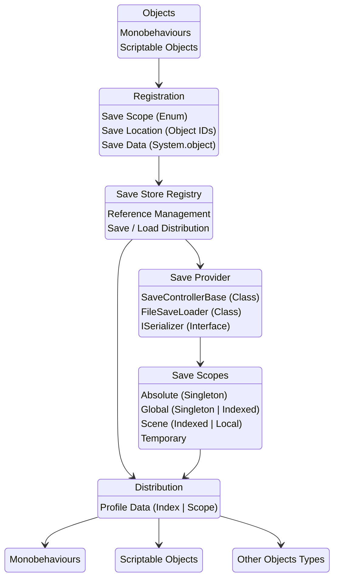

# Sanctuary
A Dynamic Save System For Unity

# System Flow Chart

# To Do: 
- [X] Finish ISerializer Interfaces
- [ ] Simplify Set Up:
    - [ ] Change Save Provider A To Static Class
    - [ ] Merge SaveControllerBase & Save Scope Based Classes
    - [ ] Offload Some FileSaveLoader Methods To Extension Methods
- [ ] Reimplement Editor Creation / Loading
- [ ] Add Save/Load Property Attributes Set Up Like Dependency Injection
- [ ] Add Stress Tests For Error Handling & Benchmarking
- [ ] Editor Tab For Locating Registered Scripts