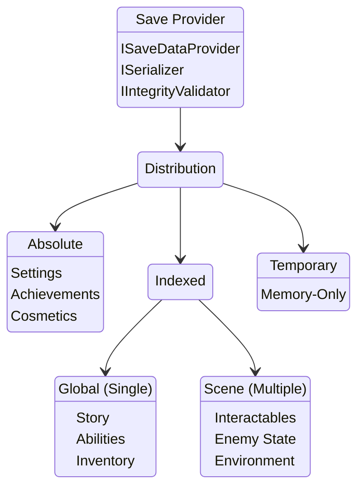

# System Flow Options

```mermaid
stateDiagram-v2
    s1 : Save Provider
    s1 : ISaveDataProvider
    s1 : ISerializer
    s1 : IIntegrityValidator

    s2 : Distribution

    s3 : Absolute
    s3 : Settings
    s3 : Achievements
    s3 : Cosmetics

    s4 : Indexed

    s5 : Global (Single)
    s5 : Story
    s5 : Abilities
    s5 : Inventory

    s6 : Scene (Multiple)
    s6 : Interactables
    s6 : Enemy State
    s6 : Environment

    s7 : Temporary
    s7 : Memory-Only
     
    s1 --> s2

    s2 --> s3
    s2 --> s4

    s4 --> s5
    s4 --> s6

    s2 --> s7
```